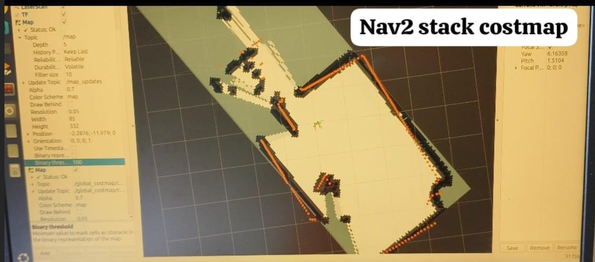

# IITH_Autonomous_Navigation_Deployment
## If using ydlidar then follow these steps
### 1)Setting up YD-LIDAR SDK
#### i)Cloning the repo
```bash
git clone https://github.com/YDLIDAR/YDLidar-SDK.git
cd YDLidar-SDK
mkdir build
cd build
cmake ..
make
sudo make install
```
#### ii)Python API install separtately:
```bash
cd YDLidar-SDK
pip install .

# Another method
python setup.py build
python setup.py install
```
#### iii)Additional steps and test
```bash
cpack
./tri_test
```
It should show something like this in the the terminal
```bash
__   ______  _     ___ ____    _    ____
\ \ / /  _ \| |   |_ _|  _ \  / \  |  _ \ 
 \ V /| | | | |    | || | | |/ _ \ | |_) | 
  | | | |_| | |___ | || |_| / ___ \|  _ <
  |_| |____/|_____|___|____/_/   \_\_| \_\ 

Baudrate:
0. 115200
1. 128000
2. 153600
3. 230400
4. 512000
Please select the lidar baudrate:4
Whether the Lidar is one-way communication[yes/no]:no
Please enter the lidar scan frequency[5-12]:10
```
If the above shows up in the terminal then your sdk installation is successful please proceed to the next step
### 2)Running ydlidar_ros2_driver
```bash
cd ydlidar
rm -rf ~/.build ~/.log ~/.install
colcon build
source install/setup.bash
ros2 launch ydlidar_ros2_driver ydlidar_launch_view.py
```
#### This should show up something like below on the screen

If the above shows up proceed to the next step
## Uploading .ino codes to the esp32 or preferred microcontroller.Kindly note I am using esp32 ddsm hat(A) if you are using other microcontroller you have to make changes to the below codes
### 1st option:-Serial odom codes(preffered)
#### i)Upload Serial_ESP32.ino into your microcontroller by using Arduino IDE
#### ii)After this create a new folder with the following command
```bash
mkdir ros4_ws
cd ros4_ws
```
#### iii)Copy paste the src folder in this repo into this navigation_ws
```bash
colcon build
source install/setup.bash
ros2 run serial_odom serial_odom_node
```
#### iv) Open another terminal and run the following command
```bash
ros2 node list
```
This should give a output showing "serial odom node" just after running the above command.If this is the case proceed to the next step
### 2nd option:-Microros codes(Not preffered unreliable with timing issues causing slam map generation to fail sometimes)
#### i)Upload micro_ros.ino into your microcontroller by using Arduino IDE
#### ii)Open another terminal and run the following command
```bash
ros2 topic list
```
This should give a output showing topics showing "/odom, /tf, /joint_states" just after running the above command.If this is the case proceed to the next step
## Setting up and running slam map generation on the robot
### Open another terminal and run the below commands
#### Kindly install slam_toolbox with below commands
```bash
sudo apt install ros-${ROS_DISTRO}-slam-toolbox
```
Kindly replace ${ROS_DISTRO} with jazzy,humble,etc
#### Launch slam_toolbox with below commands
```bash
ros2 launch slam_toolbox online_async_launch.py
```
#### This should show an rviz screen like below

If this does not popup please reach out to me and share the pdf generated from running the below command
```bash
ros2 run tf2_tools view_frames
```
## Running Autonomous Navigation and Dynamic Obstacle avoidance
```bash
ros2 launch nav2_bringup navigation_launch.py
```
### Open another terminal
```bash
ros2 launch nav2_bringup localization_launch.py
```
### In some cases in both the above commands you may need to provide the nav2_params files in order for nav2 to run smoothly you can do so by adding the following statement at the end of the above two statements
params_file:=path to your params file/nav2_params.yaml
```bash
ros2 launch nav2_bringup navigation_launch.py params_file:=/home/rpi-1/nav2_params.yaml
ros2 launch nav2_bringup localization_launch.py params_file:=/home/rpi-1/nav2_params.yaml
```
The above to is the location to my params file replace them with the correct location of your params file or it will fail
### On succesfully completing this a costmap as show below should launch on rviz.You first have to give current orientation of the robot and then give a target goal.Hence you have successfully completed autonomous navigation with dynamic obstacle avoidance on your robot



