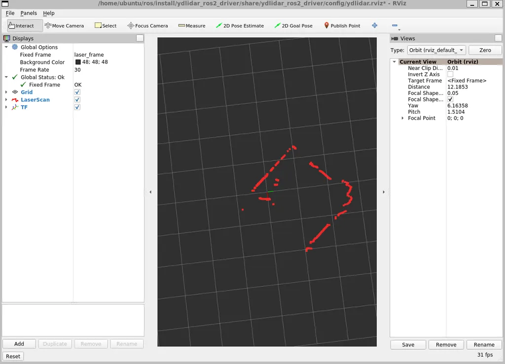
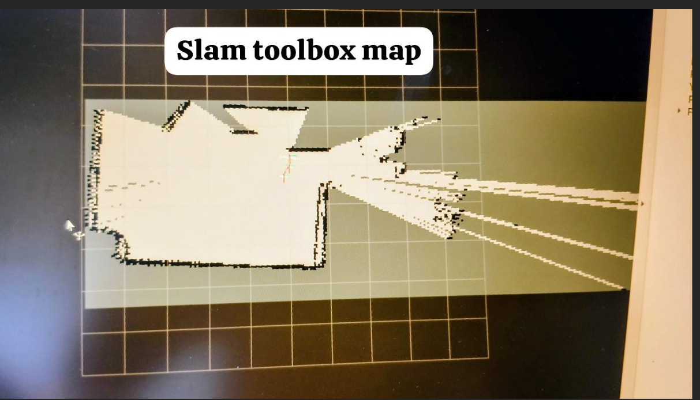

# IITH_Autonomous_Navigation_Deployment
## If using ydlidar then follow these steps
### 1)Setting up YD-LIDAR SDK
#### i)Cloning the repo
```bash
git clone https://github.com/YDLIDAR/YDLidar-SDK.git
cd YDLidar-SDK
mkdir build
cd build
cmake ..
make
sudo make install
```
#### ii)Python API install separtately:
```bash
cd YDLidar-SDK
pip install .

# Another method
python setup.py build
python setup.py install
```
#### iii)Additional steps and test
```bash
cpack
./tri_test
```
It should show something like this in the the terminal
```bash
__   ______  _     ___ ____    _    ____
\ \ / /  _ \| |   |_ _|  _ \  / \  |  _ \ 
 \ V /| | | | |    | || | | |/ _ \ | |_) | 
  | | | |_| | |___ | || |_| / ___ \|  _ <
  |_| |____/|_____|___|____/_/   \_\_| \_\ 

Baudrate:
0. 115200
1. 128000
2. 153600
3. 230400
4. 512000
Please select the lidar baudrate:4
Whether the Lidar is one-way communication[yes/no]:no
Please enter the lidar scan frequency[5-12]:10
```
If the above showa up in the terminal then your sdk installation is successful please proceed to the next step
### 2)Running ydlidar_ros2_driver
```bash
cd ydlidar
rm -rf ~/.build ~/.log ~/.install
colcon build
source install/setup.bash
ros2 launch ydlidar_ros2_driver ydlidar_launch_view.py
```
#### This should show up something like below on the screen

If the above shows up proceed to the next step
## Setting up and running slam map generation on the robot
### Open another terminal and run the below commands
#### Kindly install slam_toolbox with below commands
```bash
sudo apt install ros-${ROS_DISTRO}-slam-toolbox
```
Kindly replace ${ROS_DISTRO} with jazzy,humble,etc
#### Launch slam_toolbox with below commands
```bash
ros2 launch slam_toolbox online_async_launch.py
```
#### This should show an rviz screen like below

If this does not popup please reach out to me and share the pdf generated from running the below command
```bash
ros2 run tf2_tools view_frames
```


